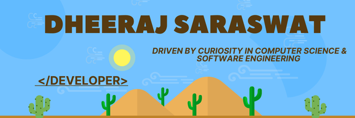

<h1  align="center" style="font-size: 3em;">
  Crafting the Web of Tomorrow, One Pixel at a Time
</h1>
  
<h1 align="center">Hey there , I'm Dheeraj Saraswat
<h2 align="center">A passionate frontend developer from India</h2>
<h4 align="left">
I'm a Computer Science graduate with a strong foundation in core CS subjects like Data Structures, Algorithms, Operating Systems, and Computer Networks.  
Passionate about building responsive, accessible, and user-friendly interfaces, I focus on turning ideas into smooth and performant digital experiences.  
Currently advancing my skills in React and modern front-end workflows while also exploring web performance, accessibility (a11y), and UI/UX design.  
</h4>
 

- 🔭 I’m currently working on **React Projects**

- 🌱 I’m currently learning **React.js and web Optimization**

- 💬 Ask me about **Front-end Development, UI/UX, Computer Science**

- 📫 How to reach me **dheerajsaraswat03@gmail.com**
- ⚡ Fun fact: When I’m not coding, I love exploring Human Psychology and the mysteries of Consciousness.

 
  
 
<h3 align="left">Connect with me:</h3>

<h3 align="left">Languages and Tools:</h3>

           

 

&nbsp;

 

 
